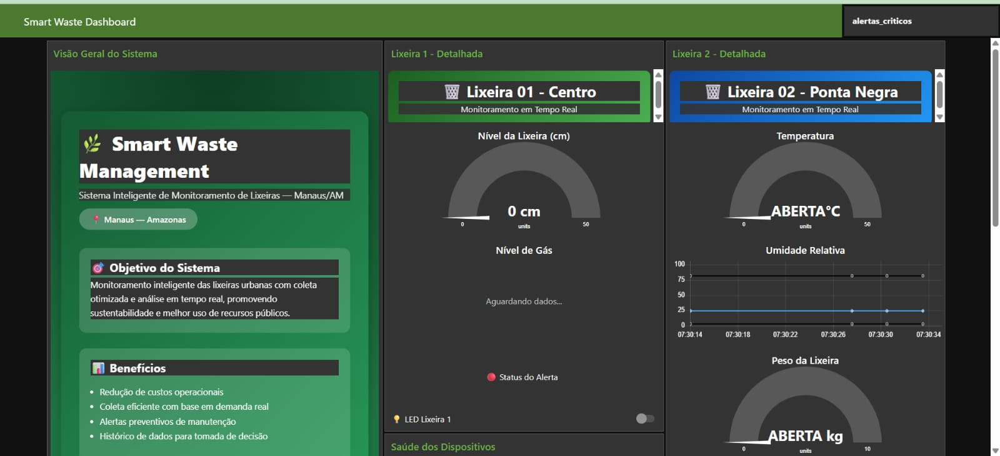
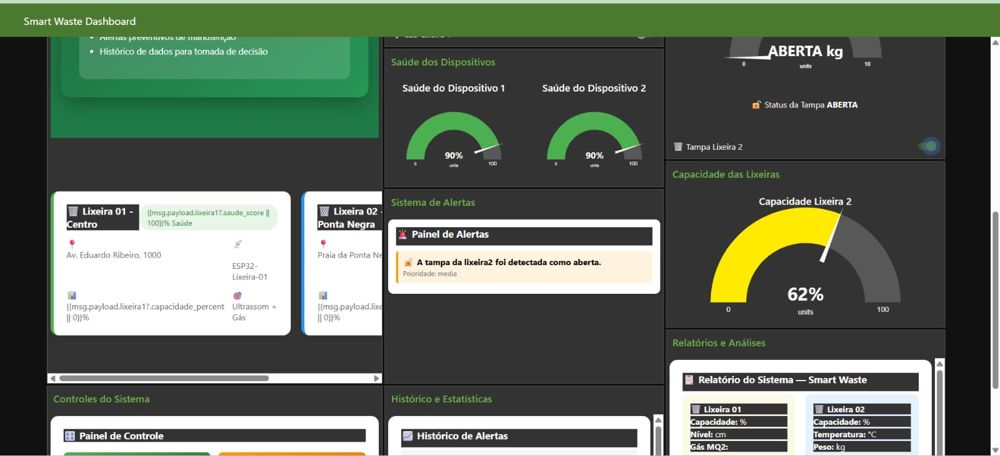
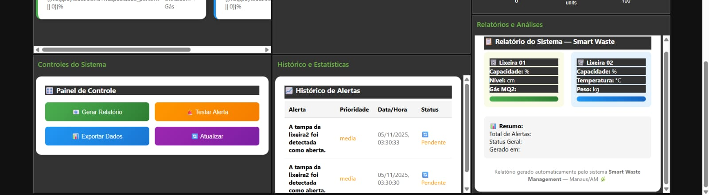

# 🗑️ Smart Waste Management System (SWMS)

## 💡 Overview  
O **Smart Waste Management System (SWMS)** é uma solução de **Cidades Inteligentes** que utiliza sistemas embarcados para monitorar e controlar o nível de resíduos urbanos.  
O projeto faz uso de **sensores e atuadores conectados via MQTT**, permitindo **monitoramento em tempo real**, **controle automático** e **notificações de emergência**.

---

## 💡 Ideia do Projeto 

O **SWMS** propõe uma abordagem automatizada para a **gestão de resíduos urbanos**, monitorando o nível de preenchimento de lixeiras inteligentes espalhadas pela cidade e otimizando o processo de coleta.  
Com isso, é possível **reduzir custos**, **evitar transbordamentos** e **melhorar a eficiência urbana**.

O sistema é composto por **duas estações embarcadas simuladas** (ESP32) no Wokwi:

- **Lixeira Inteligente 1:** Sensor ultrassônico + sensor de gás + LED de alerta  
- **Lixeira Inteligente 2:** Sensor de temperatura + sensor de peso + servo motor para tampa automática  

Cada lixeira se comunica com um **broker MQTT diferente**:
- **Lixeira 1:** `broker.test.mosquitto.org`  
- **Lixeira 2:** `broker.mqttdashboard.com`  

O armazenamento de dados é feito no **MongoDB Atlas**, enquanto o **Node-RED** atua como painel de controle e interface visual.

---

# ⚙️ Tecnologias Utilizadas  
- **ESP32 (ou Arduino UNO)** – Dispositivos embarcados simulados no Wokwi  
- **Sensores:**  
  - Ultrassônico (nível de preenchimento)  
  - MQ-2 (gases)  
  - DHT22 (temperatura e umidade)  
  - Célula de carga (peso)  
- **Atuadores:**  
  - Servo motor (abertura da tampa)  
  - LED (alerta de emergência)  
- **Comunicação:**  
  - MQTT via `broker.test.mosquitto.org` (Lixeira 1)  
  - MQTT via `broker.mqttdashboard.com` (Lixeira 2)  
- **Dashboard:** Node-RED  
- **Banco de Dados:** MongoDB Atlas  
- **Notificações:** Alertas configuráveis para temperatura, gás e nível máximo  

---

# 🧠 Funcionalidades  
- Envio periódico dos dados dos sensores via MQTT  
- Controle automático da tampa (servo) quando a lixeira enche  
- Alerta visual (LED) e notificação em caso de emergência  
- Dashboard em Node-RED com gráficos de temperatura, nível e estado das lixeiras  
- Histórico armazenado no banco de dados (MongoDB Atlas)  
- Configuração de limites de alerta personalizáveis  

---

# 🧪 Simulação  
Simulações realizadas no **Wokwi** com dois dispositivos **ESP32**, cada um conectado a um broker distinto.  

| Dispositivo | Broker | Tópico MQTT | Sensores/Atuadores |  
|--------------|---------|-------------|--------------------|  
| Lixeira 1 | `broker.test.mosquitto.org` | `swms/lixeira1/data` | Ultrassônico, MQ-2, LED |  
| Lixeira 2 | `broker.mqttdashboard.com` | `swms/lixeira2/data` | DHT22, Célula de carga, Servo |  

---

# 📊 Dashboard Node-RED  

O painel desenvolvido no **Node-RED** exibe, em tempo real, os valores dos sensores e o estado de cada lixeira.  

**📈 Dashboards em execução:**

  
  
  

---

# 🧰 Estrutura do Repositório  
```smart-waste-mqtt/
├── assets/
│   ├── dash-1.jpeg
│   ├── dash-2.jpeg
│   └── dash-3.jpeg
├── node-red/
│   └── dashboard.json
├── wokwiki/
│   ├── swmsD1_ap2_sihs.zip
│   └── swmsD2_ap2_sihs.zip
├── .gitignore
└── README.md
```
# 👥 EQUIPE  

| Nome | E-mail | Função |  
|------|---------|--------|  
| **Juliana Ballin Lima** | jbl.snf23@uea.edu.br | Banco de Dados, MQTT e Node-RED |  
| **Lucas Carvalho Dos Santos** | lcds.snf23@uea.edu.br | Hardware e Circuito |  
| **Ana Beatriz Maciel Nunes** | abmn.snf23@uea.edu.br | Node-RED e Conexão |  
| **Fernando Luiz Da Silva Freire** | fldsf.snf23@uea.edu.br | Dashboard e Visualização |  

---

# 🧠 Contexto Acadêmico  
Trabalho Final (P2) da disciplina **Sistemas Embarcados**  
Tema: **Cidades Inteligentes e IoT – Automação da Gestão de Resíduos Urbanos**

---

# 🧾 Licença  
Projeto de uso **acadêmico e educacional**, desenvolvido como parte do **Trabalho Final (P2)** da disciplina de **Sistemas Embarcados** – UEA.
